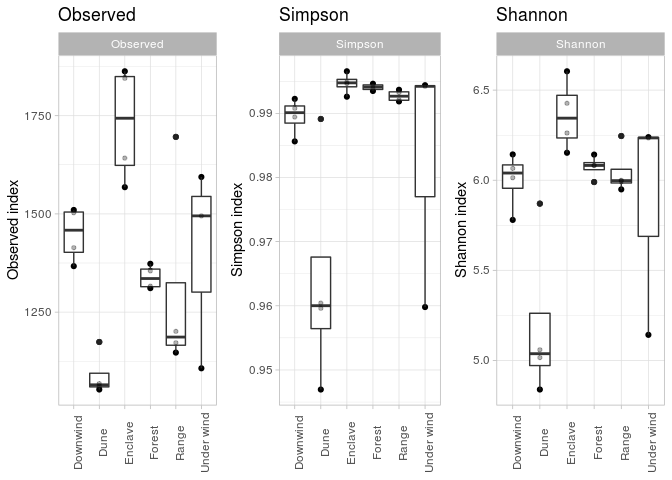
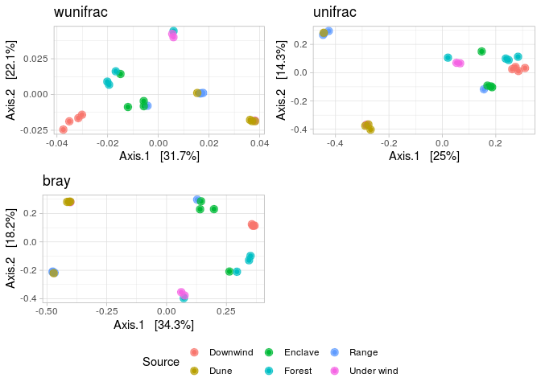
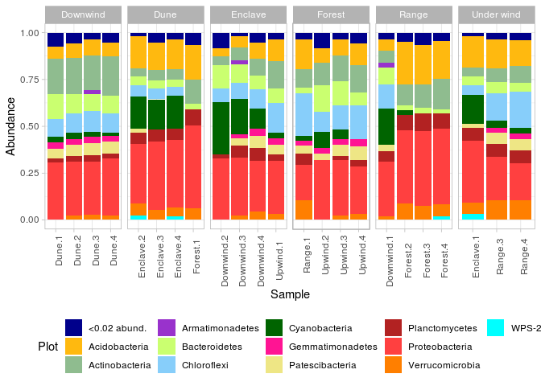

```r
library('phyloseq')
library('ggplot2')
library('dplyr')
library('plyr')
library('vegan')
library('DESeq2')
library('ggpubr')

setwd('/home/alexey/Analysis/2020_Nadym/')
set.seed(2989)

ps <- readRDS('ps.RData')

ncol(ps@otu_table)
```

```
## [1] 5411
```

```r
t(otu_table(ps)) %>% rowSums() %>% sum()
```

```
## [1] 599384
```

## Normalisation


```r
sample_sums(ps)
```

```
##   Forest.2   Forest.3   Forest.4 Downwind.1 Downwind.2 Downwind.3 Downwind.4 
##      21311      21504      23766      23183      25261      33098      25366 
##   Upwind.1   Upwind.2   Upwind.3    Range.1   Upwind.4     Dune.1     Dune.2 
##      21583      28174      22896      17887      36045      27120      27025 
##     Dune.3     Dune.4    Range.2    Range.3    Range.4  Enclave.1  Enclave.2 
##      28511      16915       5700      28384      21654      26396      26120 
##  Enclave.3  Enclave.4   Forest.1 
##      28198      28479      34808
```

```r
mdat <- read.csv('nadym_map.csv')
rownames(mdat) <- mdat$SampleID

ps@sam_data$Source <- mdat$Source


ps <- prune_samples(sample_sums(ps) > 10000, ps)
ps.n <- rarefy_even_depth(ps)
```

```
## You set `rngseed` to FALSE. Make sure you've set & recorded
##  the random seed of your session for reproducibility.
## See `?set.seed`
```

```
## ...
```

```
## 118OTUs were removed because they are no longer 
## present in any sample after random subsampling
```

```
## ...
```
---


## Alpha-diversity


```r
plot_alpha <- function(ps, metric) {
  ps_a <- prune_taxa(taxa_sums(ps) > 0, ps)
  plot_richness(ps_a, x="Source", measures=metric) + 
    geom_boxplot() +
    geom_point(size=1.2, alpha=0.3) + 
    theme_light() + scale_color_brewer(palette="Dark2") +
    theme(axis.text.x = element_text(angle = 90),
          axis.title.x=element_blank()) +
          labs(y=paste(metric, "index")) +
    ggtitle(metric)
}

ggarrange(plot_alpha(ps.n, "Observed"),
          plot_alpha(ps.n, "Simpson"), plot_alpha(ps.n, "Shannon"),
          nrow = 1, ncol = 3)
```

<!-- -->


---


## Beta-diversity


```r
#Beta-div
beta_plot <- function(ps, method, distance){
  ps.prop <- transform_sample_counts(ps, function(x) x/sum(x))
  ord.nmds.bray <- ordinate(ps.prop, method=method, distance=distance)
  plot_ordination(ps.prop, ord.nmds.bray, color = 'Source', title=distance) +
    geom_point(size=3, alpha=0.7) + 
    theme_light()
}


# beta_plot(ps.n, "NMDS", "wunifrac")
# beta_plot(ps.n, "NMDS", "unifrac")
# beta_plot(ps.n, "NMDS", "bray")
# 
# beta_plot(ps.n, "PCoA", "wunifrac")
# beta_plot(ps.n, "PCoA", "unifrac")
# beta_plot(ps.n, "PCoA", "bray")


ggarrange(beta_plot(ps, "PCoA", "wunifrac"), beta_plot(ps, "PCoA", "unifrac"), beta_plot(ps, "PCoA", "bray"),
          common.legend = T, legend = 'bottom')
```

<!-- -->


---


## Taxonomy

```r
bargraph <- function(ps, rank, threshold){
#  physeq2 = filter_taxa(ps, function(x) mean(x) > 0.1, TRUE)

  ps2 <- tax_glom(ps, taxrank = rank)
  ps3 = transform_sample_counts(ps2, function(x) x / sum(x) )
  data <- psmelt(ps3) # create dataframe from phyloseq object
  data$Plot <- as.character(data[,rank]) #convert to character
  data$Plot[data$Abundance < threshold] <- paste0("<", threshold, " abund.")
  medians <- ddply(data, ~Plot, function(x) c(median=median(x$Abundance)))
  remainder <- medians[medians$median <= threshold,]$Plot
  p <- ggplot(data=data, aes(x=Sample, y=Abundance, fill=Plot))
  p + geom_bar(aes(), stat="identity", position="stack") + theme_light() +
    scale_fill_manual(values = c("darkblue", "darkgoldenrod1", "darkseagreen", "darkorchid", "darkolivegreen1", "lightskyblue", "darkgreen", "deeppink", "khaki2", "firebrick", "brown1", "darkorange1", "cyan1", "royalblue4", "darksalmon", "darkblue",
                                 "royalblue4", "dodgerblue3", "steelblue1", "lightskyblue", "darkseagreen", "darkgoldenrod1", "darkseagreen", "darkorchid", "darkolivegreen1", "brown1", "darkorange1", "cyan1", "darkgrey")) +
    theme(legend.position="bottom") + guides() +
    theme(axis.text.x = element_text(angle = 90))
}


bargraph(ps.n, "Phylum", 0.02) + facet_grid(. ~ Source, scales = 'free_x')
```

<!-- -->


